# Multi-Agent Research Assistant with Memory & Self-Evaluation

> A team of four local agents (Planner, Research, Writer, and Critic) that read, cite, and grade their own answers over a shared [Actian VectorAI DB](https://www.actian.com/databases/vectorai-db/) memory layer.

## Demo


## Overview

**Scope: this is a research assistant over your own document collection, not a web-search agent.**
It answers questions about whatever you've ingested (papers, manuals, transcripts, notes), never
the web, and never the LLM's own training knowledge. That restriction is deliberate: it's what
lets the Critic guarantee every claim traces back to a specific retrieved passage instead of a
plausible-sounding guess. If you want an agent that goes and researches open-ended topics with web
search, see [research_team](../research_team) in this repo instead.

There is more to read than anyone can keep up with: papers, manuals, and long transcripts. A
normal chatbot answers off a single prompt, guesses when it isn't sure, and never checks its own
work. This project is closer to a small research team working over your document library: one
agent plans the research, one gathers evidence from your documents, one writes the answer, and one
grades it before it reaches you.

The repo ships with a handful of sample documents already ingested (see [Sample data](#sample-data)
below) so the demo works the moment you run it, but the library isn't static: add your own PDFs,
notes, or transcripts anytime from the **Library** tab or the CLI ingestion script, and the next
question can draw on them immediately.

An ingestion pipeline chunks and embeds every source (PDFs, papers, manuals, video transcripts)
into one shared Actian VectorAI DB collection, tagged with document and section metadata. A
LangGraph state machine then runs a question through four agents: the Planner decomposes it into
search queries, the Research agent retrieves evidence through tools (it never reads a document
directly), the Writer composes a cited answer, and the Critic scores it on correctness,
completeness, and clarity. A rejected answer loops back to Research with the Critic's specific
complaint attached, instead of blindly retrying. Answers that pass are written into a second
long-term memory collection, so a later session in the same document library builds on prior
findings instead of starting from zero. Everything runs locally: embeddings via BGE
(sentence-transformers), generation via Ollama, no external API calls.

## Features

- **Four specialist agents over a shared collection**: Planner, Research, Writer, and Critic, each a plain function over LangGraph state, sharing one Actian VectorAI DB context layer instead of passing documents around directly
- **Tool-mediated retrieval only**: the Research agent never touches a document; it calls `doc_search`, `get_section`, and `memory_search`, so every fact in a final answer traces back to a logged tool call
- **Critic-gated revision loop**: a rejected answer (average score below threshold, or ungrounded) routes back to Research with the Critic's specific complaint, capped at `MAX_REVISIONS` passes so a stubborn Critic can't spin forever
- **Persistent long-term memory**: findings that clear the Critic are embedded and written back to a `research_memory` collection; later questions in the same or later sessions retrieve them alongside raw source chunks
- **Session memory with context compression**: recent turns are kept verbatim, older ones are folded into a running summary between questions so prompts stay small without losing the thread
- **Multi-source ingestion**: PDFs, `.txt`/`.md` notes and papers, and `.vtt`/`.srt` video transcripts are sectioned (by heading or page), chunked, and tagged with `doc_id`, `section`, and `source_type` so citations point at a specific document and section
- **Built-in evaluation suite**: runs a fixed set of questions through the full graph in fresh, memory-isolated sessions and reports mean scores, pass rate, groundedness rate, and mean revisions, so a prompt change can be judged instead of guessed at
- **Full observability**: every agent step and tool call is logged with duration and metadata and rendered as a table in the UI, turning the pipeline from a black box into something you can debug
- **Fully local and offline after first run**: VectorAI DB runs in Docker, the LLM runs via Ollama, embeddings run via sentence-transformers; nothing leaves the machine

## Architecture



The Planner and Research agents run once per pass; a Critic rejection sends control back to
Research with `revision_request` attached, so the second pass retrieves against the specific gap
the Critic flagged rather than repeating the first attempt verbatim. Every agent reaches the shared
Actian VectorAI DB collections only through tools, never directly.

## Minimum System Requirements

| Component | Minimum |
|---|---|
| RAM | 16 GB |
| Disk space | 9 GB free (7.2 GB model + Docker image + embedding model) |
| Python | 3.10 or higher |
| Docker | Required for VectorAI DB |
| Ollama | Required for local generation |
| Internet | Required on first run only |

## Prerequisites

- Python 3.10+ and [uv](https://docs.astral.sh/uv/)
- Docker Desktop (or Docker Engine) installed and running
- [Ollama](https://ollama.com/) installed

### Install uv

```powershell
# Windows (PowerShell)
powershell -ExecutionPolicy ByPass -c "irm https://astral.sh/uv/install.ps1 | iex"
```

```bash
# macOS / Linux
curl -LsSf https://astral.sh/uv/install.sh | sh
```

Open a new shell afterward so the updated `PATH` takes effect, then verify with `uv --version`.

### Install Ollama and pull the model

Install from [ollama.com/download](https://ollama.com/download), then:

```bash
ollama pull gemma4:e2b
```

Gemma 4 E2B is Google's edge-sized model from the Gemma 4 family (2.3B effective parameters, 128K
context, strong instruction following for its size). Any Ollama chat model works: set
`OLLAMA_MODEL` in `.env` to use a different one.

## Setup

```bash
# Clone the repo
git clone https://github.com/Sumanth077/Hands-On-AI-Engineering.git
cd Hands-On-AI-Engineering/ai_agents/research_assistant_with_memory

# Copy and configure environment
cp .env.example .env

# Start VectorAI DB
docker compose up -d

# Make sure Ollama is running (skip if it's already running as a service)
ollama serve

# Install dependencies
uv sync

# Ingest the sample documents in data/ (two "papers", a manual, a transcript)
uv run python scripts/ingest_docs.py data/

# Run the app
uv run streamlit run app.py
```

On first run, `uv sync` and the ingestion script will download the BGE embedding model
(`BAAI/bge-small-en-v1.5`, ~130 MB) from Hugging Face; it's cached in `~/.cache/huggingface/` and
not re-downloaded on later runs.

Open `http://localhost:8501` in your browser.

## Usage

The app has four tabs.

**Ask.** Type a question and click Run. You'll see the final answer, the Critic's four scores
(correctness, completeness, clarity, overall) plus its pass/fail verdict and groundedness flag, how
many revision passes it took, the retrieved evidence with citations and relevance scores, the
Research agent's notes, and a full event log of every agent step and tool call with timings.

Try these against the sample documents in `data/`:

```
What is the main contribution of the dense passage retrieval paper?
```

```
Compare the retrieval methods described in the dense retrieval paper and the hybrid retrieval paper.
```

```
What are the main limitations of these retrieval methods?
```

Or ask more naturally, without needing to know the exact document titles first:

```
How do these two papers differ in how they handle retrieval?
```

```
What evaluation metrics show up across the indexed material, and what do they measure?
```

```
How does the VectorAI DB manual's guidance on distance metrics relate to the retrieval methods described in the papers?
```

### On grounding

This is a retrieval-augmented system by design: the Writer is instructed to never introduce facts
that are absent from the retrieved evidence, and the Critic checks for exactly that. If you ask
about something the indexed documents don't cover, `doc_search` still runs, but nothing scores
above the relevance threshold (`MIN_SCORE`, default 0.30). The Research agent reports "No relevant
passages were found," and the Critic marks the answer ungrounded rather than letting a
confident-sounding guess through.

That's worth demonstrating on purpose. Try something the sample documents have nothing to do with:

```
What is the capital of France?
```

```
Summarize the plot of Romeo and Juliet.
```

Both should come back with the Research agent reporting no relevant passages and the Critic
flagging the answer as ungrounded, instead of the model quietly answering from its own training
data.

**Library.** Shows every indexed document with its chunk count, and lets you upload more
`.pdf`, `.txt`, `.md`, `.vtt`, or `.srt` files directly from the browser.

**Evaluate.** Runs a fixed (editable) set of questions through the full graph, each in a fresh,
memory-isolated session, and reports mean scores, pass rate, groundedness rate, and mean revisions
in a table: the difference between "the demo worked once" and knowing whether a prompt change made
the system better or worse.

**Memory.** Shows how many findings are stored in long-term memory, lets you semantically search
them, and lets you reset memory without touching the indexed documents.

## Actian VectorAI DB Collections

Two collections form the shared context layer. Every agent reads through tools; nothing touches a
document or the memory store directly.

| Collection | Contents | Grows over time? |
|---|---|---|
| `research_documents` | Chunked source material (PDFs, papers, manuals, transcripts), each chunk tagged with `doc_id`, `doc_title`, `source_type`, `section`, `chunk_index` | Via ingestion (upload or script) |
| `research_memory` | Findings written back after an answer clears the Critic, embedded from `query + finding` | Yes, automatically after every passing run |

## Sample Data

For the sake of this project, [data/](data/) ships with four small original documents so the demo
has something to answer questions about the moment you run `scripts/ingest_docs.py`, no need to
find your own papers first:

| File | Stands in for |
|---|---|
| `paper_dense_passage_retrieval.md` | An academic paper (Abstract/Introduction/Method/Results/Limitations sections) |
| `paper_hybrid_retrieval_augmented_generation.md` | A second paper, for the comparison demo |
| `vectorai_operations_manual.txt` | A manual |
| `webinar_evaluating_rag_systems.srt` | A video transcript |

This is the data the app already has ingested when you first open it, that's what the three example
questions in [Usage](#usage) and the suggestion pills in the Ask tab are grounded in. It's a
starting point, not a ceiling: swap it out or add to it at any time (see below).

## Adding Your Own Documents

Use the **Library** tab in the running app to upload files directly, or ingest from the command
line:

```bash
# A whole directory
uv run python scripts/ingest_docs.py data/

# Individual files
uv run python scripts/ingest_docs.py data/paper.pdf data/notes.md data/talk.vtt
```

Re-running on the same file appends a fresh copy of its chunks rather than replacing them; clear
`research_documents` first (drop and recreate the collection, or reset the Docker volume) if you
want to re-index from scratch. Supported extensions: `.pdf`, `.txt`, `.md`, `.vtt`, `.srt`.

## Models

| Component | Model | Size |
|---|---|---|
| Embeddings | BAAI/bge-small-en-v1.5 (sentence-transformers) | ~130 MB, 384-dim vectors |
| Language model | Gemma 4 E2B via Ollama, default `gemma4:e2b` (configurable) | ~7.2 GB |

Both are cached after first use: the embedding model in `~/.cache/huggingface/`, the LLM by Ollama
itself.

## Tech Stack

| Component | Library |
|---|---|
| Vector database | [Actian VectorAI DB (Docker)](https://www.actian.com/databases/vectorai-db/) |
| Vector DB client | actian-vectorai-client |
| Orchestration | [LangGraph](https://github.com/langchain-ai/langgraph) (Planner-driven state graph with a Critic feedback loop) |
| Embeddings | sentence-transformers (BAAI/bge-small-en-v1.5) |
| Language model | Gemma 4 E2B via Ollama (model configurable) |
| PDF parsing | pypdf |
| UI | Streamlit |
| Package manager | uv |

## Project Structure

```
research_assistant_with_memory/
├── app.py                                          # Streamlit UI: Ask, Library, Evaluate, Memory tabs
├── docker-compose.yml                              # VectorAI DB server
├── pyproject.toml                                  # Dependencies (uv)
├── .env.example                                    # VectorAI DB / Ollama / embedding config
├── README.md
├── assets/
│   └── architecture.svg                            # Architecture diagram
├── data/                                           # Sample sources for the demo
│   ├── paper_dense_passage_retrieval.md
│   ├── paper_hybrid_retrieval_augmented_generation.md
│   ├── vectorai_operations_manual.txt
│   └── webinar_evaluating_rag_systems.srt
├── scripts/
│   └── ingest_docs.py                              # CLI bulk ingestion
└── research_assistant/
    ├── config.py                                   # All tuneable constants
    ├── embedder.py                                 # BGE embedding wrapper (asymmetric query/passage)
    ├── ingest.py                                   # Load, section, chunk, tag
    ├── vectorstore.py                               # VectorAI DB client, collections, read/write
    ├── tools.py                                    # doc_search / get_section / memory_search
    ├── llm.py                                       # Ollama wrapper (prose + structured JSON)
    ├── agents.py                                    # Planner, Research, Writer, Critic
    ├── graph.py                                     # LangGraph wiring + revision loop
    ├── memory.py                                    # Session state + context compression
    ├── evaluation.py                                # Fixed-question eval suite
    └── observability.py                             # Event logging
```

## How It Works

**Ingestion.** Each file is loaded, split into sections by heading (or PDF page, or stripped of
transcript timestamps and cue numbers), then chunked with sentence-boundary-aware character
windows. Every chunk is embedded with BGE (passages get no instruction prefix; queries do) and
written to `research_documents` with `doc_id`, `doc_title`, `source_type`, `section`, and
`chunk_index` in its payload, the metadata that lets the Writer cite a specific document and
section instead of vaguely gesturing at "the sources".

**Planner.** Reads the question and the session's conversation context (recent turns verbatim,
older turns compressed into a running summary) and returns a JSON plan: intent
(`single_doc` / `comparison` / `synthesis` / `followup`), one to four standalone sub-queries, and
whether to pull long-term memory. A comparison question gets one sub-query per item being compared.

**Research.** Runs each sub-query through `doc_search` (and `memory_search` if the Planner asked
for it), deduplicates the results by `(doc_id, chunk_index, origin)` keeping the best score, and
synthesizes bullet-point notes that state only what the retrieved passages support, attributed to
their source labels, with gaps in coverage stated explicitly rather than papered over.

**Writer.** Turns the notes plus conversation context into a structured answer: a direct opening
sentence, supporting detail under short headings where useful, inline citations back to the note
labels, and honest statement of any limitation the notes flagged.

**Critic.** Grades the answer strictly against the evidence it was given, not against the model's
own knowledge, on correctness, completeness, and clarity from 1-5, and separately flags whether
every claim is grounded in the evidence. If the average falls below `CRITIC_PASS_THRESHOLD` (default
3.5) or groundedness fails, the graph loops back to Research with the Critic's `revision_request`,
up to `MAX_REVISIONS` times before accepting the best effort.

**Persist.** Only answers that clear the Critic are embedded and written to `research_memory`.
Persisting a rejected answer would poison future retrievals with your own bad output, the failure
mode that makes naive "agent memory" get worse over time instead of better.

## Stopping VectorAI DB

```bash
docker compose down
```

Data persists in `./vectorai_data/` and is available again on the next `docker compose up -d`.

[Back to Top](#multi-agent-research-assistant-with-memory--self-evaluation)
