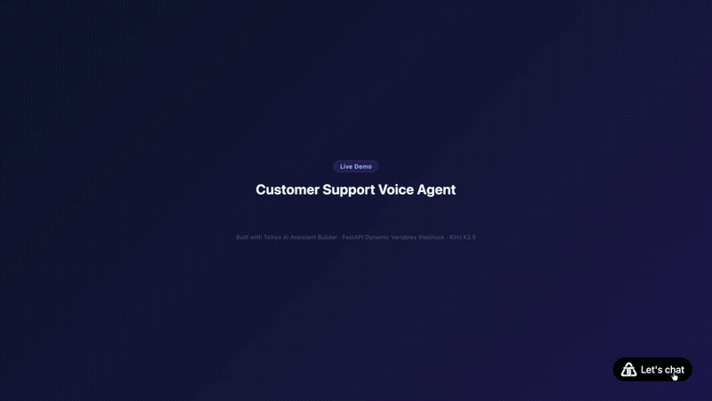
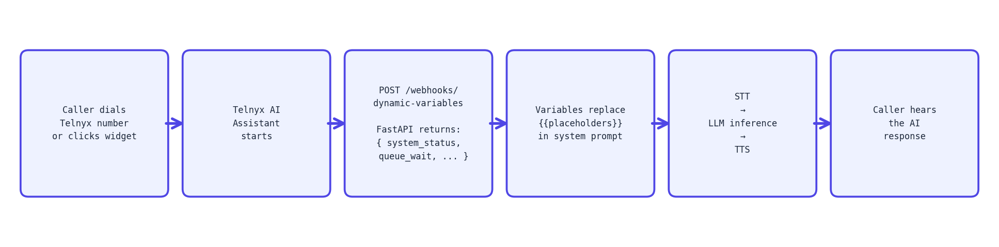

# Customer Support Voice Agent (Telnyx AI Assistant Builder)



A voice AI agent that answers phone calls and handles customer support conversations. Configured in the Telnyx portal (no-code) with a FastAPI webhook that injects real-time context into every call.

## Overview

This project uses the **Telnyx AI Assistant Builder** to configure the agent, model, voice, system prompt and phone number entirely in the Telnyx portal. A FastAPI server contributes a **Dynamic Variables webhook**: Telnyx calls it at the start of every call, and it return live data that gets injected into the agent's system prompt.

**What Telnyx portal handles:** STT, LLM inference, TTS, phone number routing, conversation history, embeddable browser widget.

**What this code handles:** real-time context injection via Dynamic Variables webhook.

## How It Works



## Tech Stack

| Layer | Tool |
|---|---|
| Agent configuration | Telnyx AI Assistant Builder (no-code portal) |
| LLM | `moonshotai/Kimi-K2.5` via Telnyx (no external API key) |
| STT | Telnyx native |
| TTS | Telnyx native |
| Context webhook | FastAPI + Uvicorn |
| Browser demo | Telnyx embeddable widget (from portal Widget tab) |
| Package manager | uv |

## Prerequisites

- Python 3.10 or higher
- [uv](https://docs.astral.sh/uv/) (`pip install uv`)
- [ngrok](https://ngrok.com) to expose your webhook during development
- A [Telnyx account](https://portal.telnyx.com/sign-up) with a funded balance

## Telnyx Portal Setup

All of this is done at [portal.telnyx.com](https://portal.telnyx.com).

### Step 1: Get your API credentials

- Copy your **API Key** (starts with `KEY...`)
- Click the **Public Key** tab on the same page and copy your **Ed25519 Public Key**

### Step 2: Buy a phone number

- Search for a US number and purchase it

### Step 3: Create your AI Assistant

- Left sidebar → **AI** section → **AI Assistants** → **Create New**
- Choose **Blank Template**
- Fill in the **Instructions** field (paste the system prompt below):

```
You are a customer support agent for a full-service retail bank serving personal
and business customers.

Keep all responses under 2 sentences -- callers are listening, not reading.
Speak calmly and professionally. If a question is not covered in the knowledge
base below, acknowledge it warmly and offer to transfer the caller to a specialist.

System status: {{system_status}}
Active incidents: {{todays_incidents}}
Queue wait: {{current_queue_wait}}
Business hours: {{business_hours}}
Support email: {{support_email}}

--- KNOWLEDGE BASE ---

ACCOUNTS
We offer three personal account tiers. The Everyday Checking account carries no
minimum balance, includes a free debit card and online bill pay, and reimburses up
to $10 in ATM fees each month. The Premier Checking account charges a $12 monthly
fee that is waived when the customer maintains a $2,500 minimum daily balance or
receives a recurring direct deposit of at least $1,000 per month; it also earns
0.05% APY. The Savings account currently earns 4.25% APY with no minimum balance
required; customers may make up to 6 withdrawals per month before a $5 excess
withdrawal fee applies.

DEBIT AND CREDIT CARDS
Customers who lose a card or believe it has been stolen should report it immediately
by calling the 24-hour card hotline at 1-800-555-0199 or by freezing the card
instantly through Card Controls in the mobile app. A replacement card arrives within
5 to 7 business days. Transaction disputes must be filed within 60 days of the
statement date and are typically resolved within 10 business days. Temporary card
freezes and unfreezes are available at any time in the mobile app -- no call required.

TRANSFERS AND PAYMENTS
Outgoing domestic wire transfers submitted before 3:00 PM EST on a business day are
processed the same day; transfers submitted after the cut-off are processed the
following business day. The fee is $25 for outgoing and $15 for incoming domestic
wires. Zelle transfers between enrolled customers typically arrive within minutes.
ACH transfers to external accounts take 1 to 3 business days. Customers can link up
to 5 external accounts under Transfers in Online Banking.

LOANS
Personal loans are available from $2,000 to $50,000 with fixed APRs between 7.99%
and 24.99% based on credit profile and term length. Auto loans for new and used
vehicles start at 5.49% APR for 60-month terms. Mortgage pre-qualification is
available online and takes approximately 2 business days. All loan applications can
be started on our website or at any branch.

ONLINE BANKING AND MOBILE APP
Customers who forget their Online Banking password can reset it on our website by
selecting Forgot Password; a verification code is sent to the registered email or
phone number. After 5 failed login attempts the account is locked and must be
unlocked by calling support or visiting a branch with a valid government-issued ID.
The mobile app supports mobile check deposit, card controls, spending insights, and
Zelle. Checks deposited before 8:00 PM EST on a business day are available the
next business day.

SECURITY AND FRAUD
We will never ask for a full Social Security number, password, or one-time passcode
over the phone or by text. Customers who suspect fraud should call the 24-hour fraud
line at 1-800-555-0911 immediately. Accounts flagged for suspicious activity are
frozen automatically and the customer is notified by both text and email. Two-factor
authentication is strongly recommended and can be enabled under Security Settings in
Online Banking.

FEES
Monthly maintenance fees are $0 for Everyday Checking, $12 for Premier Checking
(waived with qualifying activity), and $0 for the Savings account. Overdraft
protection transfers cost $10 per transfer. Stop payment requests are $30 per item.
Paper statement delivery costs $3 per month; electronic statements are always free.
There is no fee for incoming ACH transfers or standard online bill payments.

BRANCHES AND ATMS
We operate 47 branches across the Northeast, open Monday through Friday 9 AM to
5 PM EST and Saturday 9 AM to 1 PM EST. Customers have surcharge-free access to
over 55,000 ATMs in the Allpoint network nationwide. Branch and ATM locations are
available on our website or through the mobile app.
```

- Set the **Greeting**:

```
Hi, thanks for calling customer support. How can I help you today?
```

- Under **Agent** tab: set Model to `moonshotai/Kimi-K2.5`
- Leave Voice settings as default for now
- Click **Save**

### Step 4: Assign your phone number

After creation, assign the number you bought in Step 2 to this assistant.

### Step 5: Test directly in the portal

Inside your assistant, click the **Test** button. The portal has a built-in web call interface, no phone, no ngrok needed. Speak to your agent right there.

### Step 6: Set the Dynamic Variables webhook URL

In your assistant settings, look for the **Dynamic Variables** section:

- Set the webhook URL to: `https://your-ngrok-url.ngrok.io/webhooks/dynamic-variables`
- You will update this after running ngrok in the setup steps below

### Step 7: Open the browser widget demo

`demo.html` already contains the live widget embed. Open it in any browser, no server needed, it loads the widget directly from Telnyx's CDN and connects to the assistant via WebRTC.

## Installation

### 1. Clone the repository

```bash
git clone https://github.com/Sumanth077/Hands-On-AI-Engineering.git
cd Hands-On-AI-Engineering/voice_apps/saas_customer_support_voice_agent
```

### 2. Create virtual environment

```bash
uv venv
source .venv/bin/activate  # Windows: .venv\Scripts\activate
```

### 3. Install dependencies

```bash
uv pip install -e .
```

### 4. Set up environment variables

```bash
cp .env.example .env
```

Edit `.env`:

```bash
TELNYX_API_KEY=KEYxxxxxxxxxxxxxxxx
TELNYX_PUBLIC_KEY=your_ed25519_public_key_here
```

## Running the Webhook Server

```bash
python main.py
```

Server starts at `http://127.0.0.1:8000`.

In a separate terminal, expose it with ngrok:

```bash
ngrok http 8000
```

Copy the HTTPS URL (e.g. `https://abc123.ngrok.io`) and update the Dynamic Variables webhook URL in your Telnyx AI Assistant to `https://abc123.ngrok.io/webhooks/dynamic-variables`.

Health check:

```bash
curl http://localhost:8000/health
```

## Project Structure

```
customer_support_voice_agent/
├── main.py          # FastAPI server -- Dynamic Variables webhook
├── demo.html        # Browser demo -- open in any browser to try the agent via WebRTC
├── pyproject.toml   # uv dependencies
├── .env.example     # Environment variable template
├── .gitignore
└── README.md
```

## Customising the Dynamic Variables

Open `main.py` and update `get_live_context()` to pull real data from your systems:

```python
def get_live_context() -> dict:
    # Replace with real lookups:
    return {
        "system_status": fetch_status_page(),        # your status API
        "current_queue_wait": fetch_queue_wait(),    # your support queue
        "business_hours": "Mon-Fri, 9AM-6PM EST",
        "support_email": "support@yourcompany.com",
        "todays_incidents": fetch_incidents(),       # PagerDuty, OpsGenie
    }
```

## Demo

The primary way to interact with this agent is by calling the Telnyx phone number you assigned in Step 4. The caller dials in, the Dynamic Variables webhook fires, and the AI handles the conversation end-to-end -- STT, LLM, TTS, all through Telnyx.

For this tutorial we also ship `demo.html`, a browser widget that connects to the same assistant over WebRTC so you can try it without making a phone call. See the [Telnyx AI Agent Widget docs](https://developers.telnyx.com/docs/inference/ai-assistants/ai-agent-widget) for details on how the embed works.

Open `demo.html` in any browser -- no server needed.

### Try asking

The demo uses a fictional bank as the support persona. All of the following questions are grounded in the knowledge base in the Instructions field:

- "I think my debit card was stolen -- what should I do?"
- "What is the current savings account interest rate?"
- "How long does a wire transfer take, and what does it cost?"
- "My online banking account is locked. How do I get back in?"
- "How do I dispute a charge on my account?"
- "Can I freeze my card from the app without calling?" 
- "What are your branch hours?"

### How the knowledge base works

The knowledge base lives inline in the assistant's **Instructions** field in the Telnyx portal -- no separate KB service, no vector database, no retrieval pipeline. The model reads the full KB on every call and uses it to answer questions accurately.

This is the right approach for demos and small-to-medium support playbooks (under ~8000 tokens). For production at scale, Telnyx also supports a dedicated Knowledge Bases feature where you upload documents and the assistant retrieves relevant chunks automatically.

## Resources

- [Telnyx AI Assistant Builder docs](https://developers.telnyx.com/docs/inference/ai-assistants/no-code-voice-assistant)
- [Dynamic Variables docs](https://developers.telnyx.com/docs/inference/ai-assistants/dynamic-variables)
- [Available models](https://developers.telnyx.com/docs/inference/models) -- `moonshotai/Kimi-K2.5` is the recommended balance of intelligence and cost
- [Telnyx Portal](https://portal.telnyx.com)

[Back to Top](#saas-customer-support-voice-agent-telnyx-ai-assistant-builder)
