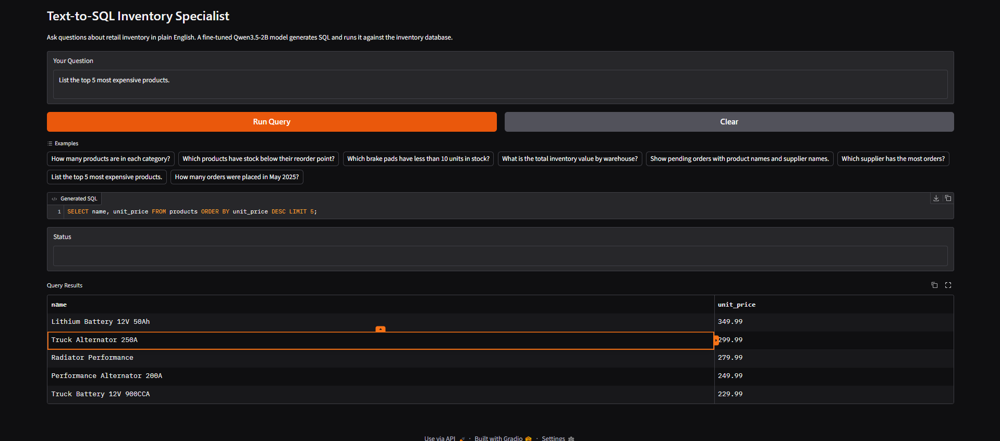

# Text-to-SQL Inventory Specialist
> A natural language interface for querying retail inventory databases using a fine-tuned Qwen3.5-2B model.

## Overview
Text-to-SQL Inventory Specialist lets you ask plain English questions about retail auto parts inventory and get SQL-backed answers. A Gradio web app loads a fine-tuned Qwen3.5-2B model from Hugging Face, generates SQLite queries, and runs them against a pre-populated inventory database covering products, stock levels, warehouses, suppliers, and orders.

## Demo


## Features
- Natural language to SQL conversion for inventory questions
- Fine-tuned Qwen3.5-2B model via Hugging Face Transformers
- Pre-populated SQLite database with 56 realistic auto parts across 10 categories
- Gradio UI with example questions, SQL display, and tabular results
- Safe read-only query execution (SELECT only)
- Training notebook for Unsloth + TRL supervised fine-tuning on Google Colab
- Custom dataset of 200 inventory-specific question-to-SQL pairs

## Tech Stack
**Fine-Tuning:**
- Unsloth + TRL (SFT Trainer) - QLoRA fine-tuning on Google Colab T4 GPU
- Qwen3.5-2B - base model fine-tuned on 200 custom inventory SQL pairs

**Inference:**
- Hugging Face Transformers - local model loading from Hecodes/text-to-sql-inventory
- SQLite - inventory database with products, stock levels, warehouses, suppliers, orders

**UI:**
- Gradio

## Prerequisites
- Python 3.10+
- 8GB RAM minimum
- Hugging Face account (optional, for retraining only)

## Setup

### 1. Clone the Repository
```bash
git clone https://github.com/Sumanth077/Hands-On-AI-Engineering.git
cd Hands-On-AI-Engineering/fine_tuning/text_to_sql_inventory
```
For a standalone copy of this project only, clone the repository and `cd text_to_sql_inventory`.

### 2. Create Virtual Environment
```bash
python -m venv .venv
.venv\Scripts\activate  # Windows
source .venv/bin/activate  # macOS/Linux
```

### 3. Install Dependencies
```bash
pip install -r requirements.txt
```

### 4. Configure Environment
```bash
copy .env.example .env  # Windows
cp .env.example .env    # macOS/Linux
```
Edit `.env` and set `HF_TOKEN` if the Hugging Face model is gated.

### 5. Initialize the Database
```bash
python database.py
```

### 6. Run the App
```bash
python app.py
```
Gradio opens at http://127.0.0.1:7860. On first run, the app downloads the fine-tuned model from Hugging Face and caches it locally.

## Usage
Type a plain English question and click **Run Query**. The model generates SQL, runs it against the inventory database, and displays the results as a table.

Example questions:
- "How many products are in each category?"
- "Which products have stock below their reorder point?"
- "Which brake pads have less than 10 units in stock?"
- "What is the total inventory value by warehouse?"
- "Which supplier has the most orders?"

## Project Structure
```
text_to_sql_inventory/
├── app.py               # Gradio web application
├── database.py          # SQLite setup and query execution
├── inference.py         # Hugging Face Transformers inference
├── prepare_dataset.py   # Custom dataset generation (200 inventory pairs)
├── train.ipynb          # Google Colab fine-tuning notebook
├── requirements.txt
├── .env.example
├── .gitignore
├── README.md
├── assets/
│   └── demo.png
└── data/
    ├── inventory.db     # Pre-populated inventory database
    └── dataset.jsonl    # 200 custom training pairs
```

## How It Works
1. **Dataset** - `prepare_dataset.py` generates 200 custom question-to-SQL pairs specifically designed for the inventory schema (products, stock_levels, warehouses, suppliers, orders).
2. **Fine-tuning** - `train.ipynb` fine-tunes Qwen3.5-2B using Unsloth and TRL SFT Trainer with QLoRA on Google Colab T4 GPU for 2 epochs. The merged model is pushed to Hugging Face at Hecodes/text-to-sql-inventory.
3. **Inference** - `inference.py` loads the fine-tuned model from Hugging Face at startup, builds a schema-aware prompt, and generates SQL using Hugging Face Transformers on CPU.
4. **App** - `app.py` connects inference and database execution in a Gradio UI with example questions and error handling.
